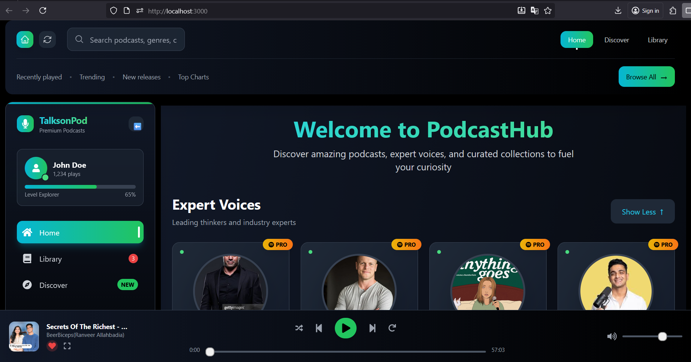
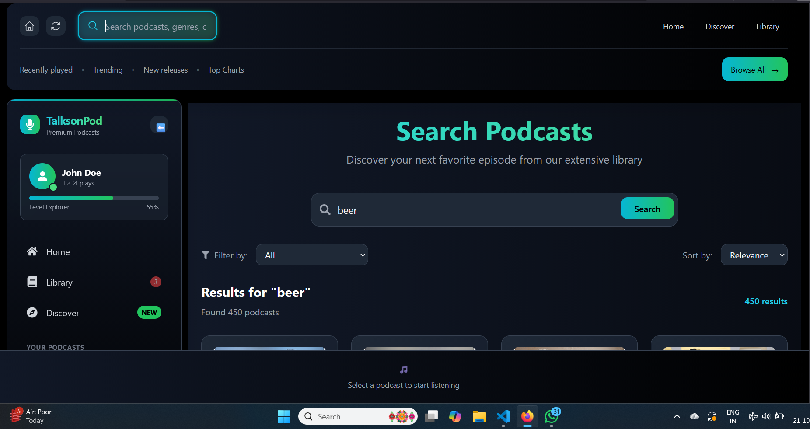
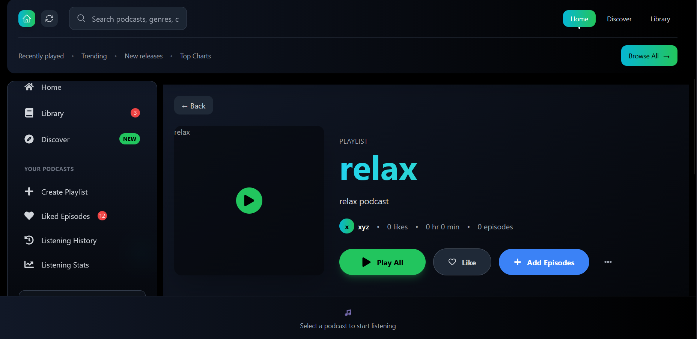

````markdown
# 🎙️ TalksOnPod — Modern Podcast Streaming Platform




> **TalksOnPod** is a premium, modern podcast streaming platform that delivers a stunning listening experience with intelligent content discovery, seamless playback, and a beautifully responsive interface.

---

## ✨ Preview

| Home | Search | Playlist |
|------|---------|-----------|
|  |  |  |

---

## 🚀 Features

### 🎯 Core Functionality
- **Smart Search:** Real-time suggestions, filters, and genre sorting  
- **Seamless Playback:** Pro audio player with progress, volume, and keyboard shortcuts  
- **Personal Library:** Like, create playlists, and track listening history  
- **Fully Responsive:** Optimized for desktop, tablet, and mobile  

### 🎨 User Experience
- **Modern Design:** Smooth animations and award-level UX  
- **Dark Mode:** Professionally themed dark interface  
- **High Performance:** Lazy loading and efficient state management  
- **Smart Notifications:** Real-time badges and updates  

### 🎧 Discovery & Personalization
- **Expert Creators:** Discover influential podcast hosts  
- **Recommendations:** Personalized based on listening behavior  
- **Genre Browsing:** Explore podcasts by topic and mood  
- **Trending Section:** Stay updated with what’s hot  

---

## 🛠️ Tech Stack

| Layer | Technology | Purpose |
|-------|-------------|----------|
| **Framework** | React 18 + TypeScript | Component-based, type-safe UI |
| **Styling** | Tailwind CSS | Utility-first responsive design |
| **Routing** | React Router DOM | Client-side navigation |
| **Icons** | Heroicons + React Icons | Consistent icon set |
| **Build Tool** | Vite | Lightning-fast dev/build process |
| **Hosting** | Vercel | Scalable, zero-config deployment |

### Key Dependencies
```json
{
  "react": "^18.2.0",
  "typescript": "^5.0.2",
  "tailwindcss": "^3.3.0",
  "react-router-dom": "^6.8.0",
  "react-icons": "^4.8.0",
  "@heroicons/react": "^2.0.0"
}
````

---

## 📁 Folder Structure

```
src/
├── components/
│   ├── layout/          # Navbar, Sidebar, FooterPlayer
│   ├── cards/           # PodcastCard, TrendingCard, BestOfTheWeek
│   └── ui/              # Buttons, Inputs, and other UI parts
├── pages/
│   ├── Home.tsx
│   ├── SearchPage.tsx
│   ├── Library.tsx
│   ├── Playlist.tsx
│   ├── LikedEpisode.tsx
│   ├── History.tsx
│   └── VoicesInfo.tsx
├── data/
│   ├── podcast.json
│   └── podcastInfluencer.json
├── hooks/               # Custom React hooks
├── types/               # TypeScript interfaces
└── utils/               # Helper functions
```

---

## ⚡ Getting Started

### Prerequisites

* Node.js ≥ 16
* npm or yarn

### Installation

```bash
git clone https://github.com/KAquib24/PodTalks.git
cd PODTALKS
npm install
```

### Run Development Server

```bash
npm run dev
```

### Build for Production

```bash
npm run build
```

---

## 💻 Usage

### For Listeners

1. Browse featured podcasts
2. Search & filter by genres
3. Play, like, and manage episodes
4. Create playlists and view history

### For Developers

```tsx
import PodcastCard from './components/PodcastCard';

export default function MyPodcast() {
  return (
    <PodcastCard
      name="Tech Talk Daily"
      title="AI Revolution in 2024"
      image="/podcast-cover.jpg"
      onClick={() => console.log('Playing podcast')}
      listeners="1.2M"
      category="Technology"
    />
  );
}
```

---

## 🧩 Component Highlights

### 🎵 FooterPlayer

```tsx
interface FooterPlayerProps {
  currentPodcast?: Podcast;
  onNext: () => void;
  onPrevious: () => void;
  onToggleLike: (podcast: Podcast) => void;
}
```

* Full audio controls
* Volume/mute support
* Like/dislike toggle
* Keyboard shortcuts

### 🧭 Navbar

* Smart search bar with auto-suggestions
* Responsive menu
* Active route highlight

### 📚 Sidebar

* Collapsible layout
* User stats & profile
* Library shortcuts

---

## 🎨 Design System

### Colors

```css
--primary-cyan: #06b6d4;
--primary-green: #10b981;
--gray-900: #111827;
--gray-800: #1f2937;
--gray-700: #374151;
--gray-400: #9ca3af;
```

### Typography

* **Headings:** Inter, bold
* **Body:** Inter, regular
* **Code:** JetBrains Mono

### Breakpoints

| Device  | Width      | Layout        |
| ------- | ---------- | ------------- |
| Mobile  | < 768px    | Single column |
| Tablet  | 768–1024px | Two columns   |
| Desktop | > 1024px   | Full layout   |

---

## 🚀 Deployment

### Vercel (Recommended)

```bash
npm i -g vercel
vercel --prod
```

### Alternatives

```bash
# Netlify
npm run build && netlify deploy --prod --dir=dist

# Firebase
npm run build && firebase deploy

# GitHub Pages
npm install --save-dev gh-pages && npm run deploy
```

---

## 🤝 Contributing

### Steps

1. Fork the repo
2. Create a feature branch → `git checkout -b feature/amazing-feature`
3. Commit → `git commit -m "Add amazing feature"`
4. Push → `git push origin feature/amazing-feature`
5. Open a Pull Request

### Guidelines

* Use TypeScript for all components
* Maintain accessibility standards
* Follow design system conventions
* Test across devices

### Reporting Issues

Include:

* Browser + OS version
* Steps to reproduce
* Expected vs actual behavior
* Screenshots (if possible)

---

## 📜 License

This project is licensed under the **MIT License** — see [`LICENSE.md`](LICENSE.md).

---

## 🙏 Acknowledgments

* Inspired by Spotify & Apple Podcasts
* Icons: Heroicons, React Icons
* Design: Tailwind CSS
* Hosting: Vercel
* Audio: Web Audio API

---

<div align="center">

**Built with ❤️ using React, TypeScript, and Tailwind CSS**

</div>
